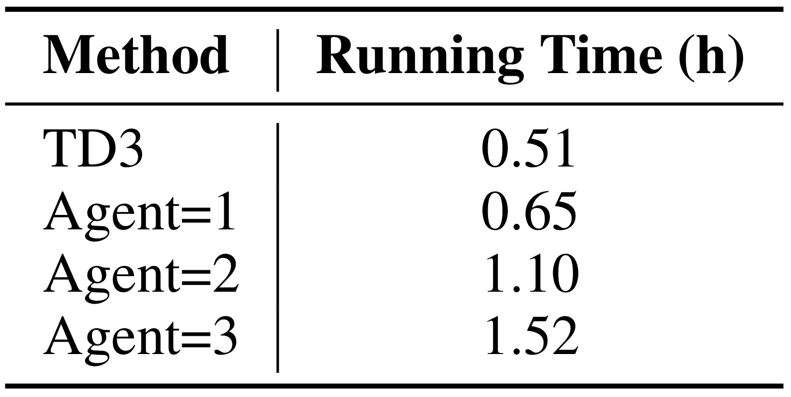
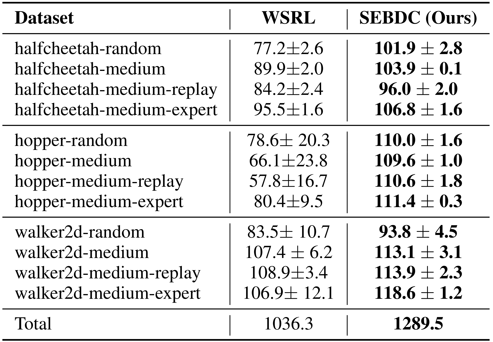
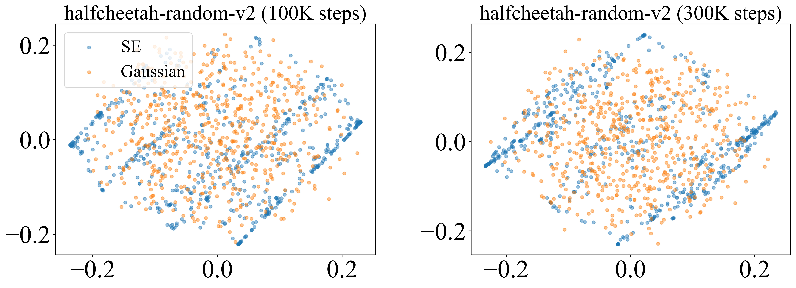
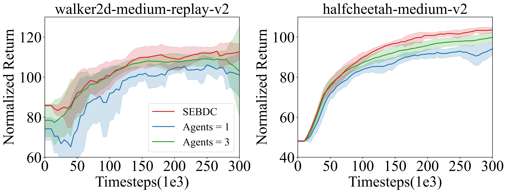
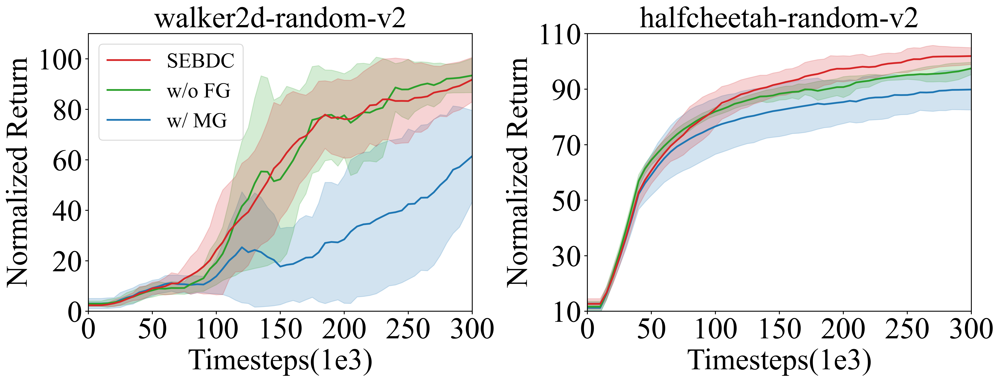
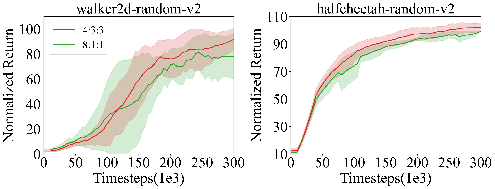

# SEBDC: Structured Exploration with Behavior Density Constraints for Offline-to-Online Reinforcement Learning (ICML 2026 Rebuttal)

### Table A. Comparison of the actual wall-clock time for 300k online fine-tuning steps of the TD3 baseline and Agents=1, Agents=2, and Agents=3 in the walker2d-medium-replay-v2 environment, using a single NVIDIA 3090 GPU. For Agents=1, Agents=2, and Agents=3, the reported time also includes behavior density model training.

---

### Table B. D4RL normalized scores on MuJoCo locomotion control tasks, after online fine-tuning, averaged over five random seeds. All methods first perform 1M steps of offline pretraining, followed by 300k steps of online fine-tuning. Unless otherwise specified, all datasets are the v2 versions.

---

### Figure A. PCA visualization of perturbation vectors at 100K and 300K online steps in the halfcheetah-random-v2 environment. For further details, please refer to Rebuttal R1-1.

---

### Figure B. The impact of varying numbers of agents on SEBDC performance in the walker2d-medium-replay-v2 and halfcheetah-medium-v2 environments. For further details, please refer to Rebuttal R1-3.

---

### Figure C. The impact of final Gaussian noise and the matched Gaussian baseline. Final Gaussian noise is removed (w/o FG), and the matched Gaussian is used to replace structured perturbations (w/ MG).

---

### Figure D. Performance comparison between SEBDC and WSRL on the D4RL MuJoCo benchmark.

---

### Figure E. Comparison of the 4:3:3 and 8:1:1 data splitting strategies. 

---

